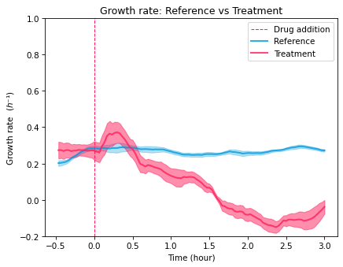
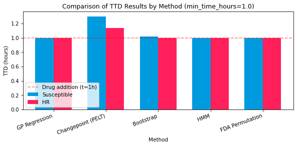
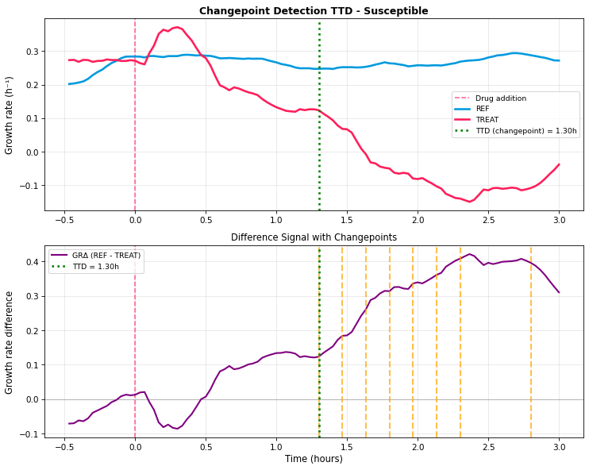

# Time-to-Detection for antibiotic susceptibility testing

Coursework for **1MD048 Research Methodology** (period 2, year 1) of the M.Sc. in Image Analysis and Machine Learning at Uppsala University.

The task: from pre-computed Omnipose segmentation masks of *Mycobacterium smegmatis* growing in a microfluidic chip, work out how soon a rifampicin-treated population can be told apart from an untreated control — the **time-to-detection (TTD)**. The sooner inhibition can be called reliably, the faster a susceptibility test reports.

## The experimental timeline (this is the crux)

Getting the acquisition timing right is the whole ballgame here, and it is worth stating up front:

| Absolute time | Frame | Event |
|---|---|---|
| 0 h | 0 | Imaging starts — **all** traps untreated, growing exponentially |
| 1 h | 30 | **Rifampicin added to the treated traps (TREAT)**; control traps (REF) stay drug-free |
| 4 h | 121 | Imaging ends |

Images are taken **every 2 minutes**, so 121 frames span ≈ 4 hours. The analysis measures time **relative to drug addition** (`t = frame·2 min − 1 h`, so `t = 0` is the moment the drug goes in) and only looks at the **post-drug window** — the first hour, before any drug is present, carries no treatment signal and is excluded. The control (REF) growth rate should stay flat throughout; only the treated (TREAT) curve should change.

> An earlier version of this analysis measured time from the start of imaging rather than from drug addition. This version corrects the timing after examiner feedback — the fix was to anchor `t = 0` to frame 30 and restrict detection to the post-drug window, which is what makes the time-to-detection meaningful.

## What the notebook does

`ttd_analysis.ipynb` builds per-frame growth time series for REF and TREAT (mean ± standard deviation across positions), fits growth rates, and then runs **five** independent detectors for the earliest reliable divergence after drug addition:

1. **Gaussian Process regression** on the growth curves (AMiGA-style; Midani 2021 / Tonner 2017)
2. **PELT changepoint detection** on the REF − TREAT difference signal (`ruptures`; Truong 2020)
3. **Bootstrap** divergence-point analysis (Efron & Tibshirani 1993)
4. **Hidden Markov Model** state detection (`hmmlearn`; Rabiner 1989)
5. **Functional data analysis** with permutation testing (Ramsay & Silverman 2005)

## Results

The control grows steadily while the treated population's growth rate collapses after the drug is added:


*Growth rate relative to drug addition (t = 0). The untreated reference (blue) stays flat at ≈ 0.25 h⁻¹; the treated population (red) drops to a negative rate within a couple of hours of rifampicin. Bands are ± standard deviation across positions.*

All five methods place the time-to-detection at roughly **1.0–1.3 h** — i.e. at, or within ~20 minutes of, the 1 h drug-addition point (mean ≈ 1.06 h on the susceptible strain). In other words, the methods pick up the antibiotic effect almost as soon as the drug is present, which is the behaviour you would expect and a sanity check that the timing is now handled correctly.


*Time-to-detection by method for the susceptible and heteroresistant strains. The dashed line marks drug addition (t = 1 h); every method detects just after it.*

The changepoint detector illustrates the mechanism — the REF − TREAT growth-rate difference is flat until the drug acts, then climbs, and PELT flags the first sustained break:


*Changepoint detection on the growth-rate difference. REF stays flat, TREAT falls, and the first detected changepoint (TTD ≈ 1.30 h) sits just after drug addition.*

## Data

The mask data is distributed through the course (Studium) and is **not** redistributed here. Download it and extract next to the notebook as `data/`:

```
data/
├── Original_data/      # susceptible strain (REF + RIF traps)
└── HR/                 # heteroresistant strain
```

## Running it

```bash
pip install -r requirements.txt        # plus scikit-learn, ruptures, hmmlearn, seaborn
```

Open `ttd_analysis.ipynb`, set the data path in the configuration cell, and run all cells. It writes the growth-curve, per-method, and comparison figures shown above.
